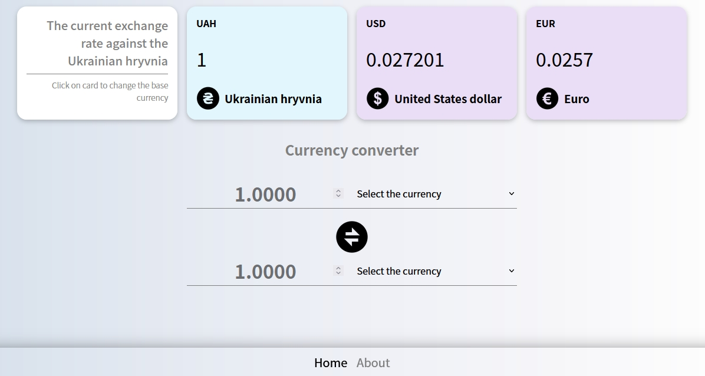

# Currency Converter App

This is an application designed to provide users with real-time currency exchange rates for various currencies. This app makes use of the  
[Free Currency Rates API](https://github.com/fawazahmed0/currency-api#readme) , which provides reliable and up-to-date exchange rate information for a wide range of currencies. 
The Currency Exchange App is user-friendly and easy to navigate, allowing users to quickly search for the desired currency exchange rate. Users can set their base currency in the header simply clicking on it and the app will display the current exchange rate for the available currency pairs.
The app also features a currency converter, allowing users to quickly convert one currency to another. Users simply need to input the amount they wish to convert, select the base currency and the target currency, and the app will display the converted amount. Additionally user can toggle the currencies by pressing the rotating button between them.
The Currency Exchange App is a powerful and reliable tool for anyone who needs access to real-time currency exchange rates and information. With its user-friendly interface and robust features, it is an essential tool for anyone who travels internationally, conducts business across borders, or simply wants to stay informed about the latest currency trends.

## Preview

##  Links
Try it now! [Currency Convertor](https://vvv-sss.github.io/currency_converter/)

##  Built with

- Angular
- Typescript
- HTML5
- SCSS

##  Author

- Volodymyr Serbulenko
- E-mail: serbulenko1volodymyr@gmail.com